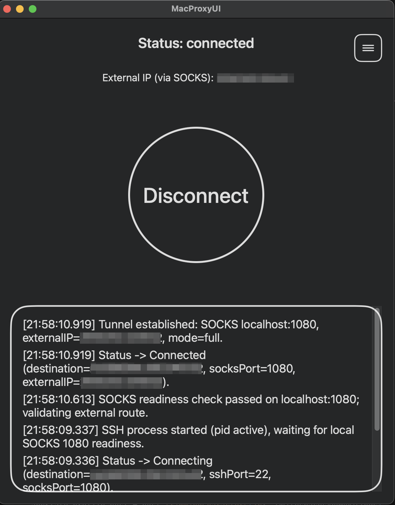

# MacProxyUI

Minimal macOS app to manage SSH connection.
Using provided settings it starts an SSH dynamic port forward and verifies the local SOCKS proxy with periodic health checks and handles reconnects.

 

## Build

```sh
swift build
```

## Package as `.app`

Create a launchable macOS app bundle with the main binary, embedded `AskpassHelper`, generated app icon, and release-friendly `Info.plist` metadata:

```sh
./scripts/package-app.sh
```

The bundle is created at:

```text
.build/app/debug/MacProxyUI.app
```

To build a release bundle:

```sh
./scripts/package-app.sh release
```

You can override bundle metadata at packaging time:

```sh
MACPROXYUI_VERSION=1.0.0 \
MACPROXYUI_BUILD=42 \
MACPROXYUI_BUNDLE_ID=com.example.MacProxyUI \
./scripts/package-app.sh release
```

You can launch the packaged app with:

```sh
open ".build/app/debug/MacProxyUI.app"
```
